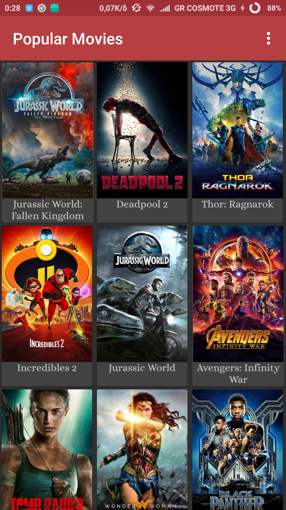

# MovieNight

## About 
This repository was created to complete a project for the *Udacity Android Developer* Nanodeegre program.

## Intro 

Android Application which shows you a list of popular/favourite  movies depending on the user preference  using the MovieDB API.

## Features

- GridView showing the movie posters alonside the title
- Detail Screen showing more info ( videos,user reviews,date of release etc) 
about the movie clicked 
- Favourite mode for offline usage

## Application Screenshots

   

## Uses

- Picaso for image loading/cache
- Retrofit + Gson for Async network calls

### In order to run

In order to use the app you should get an API key from the MoviesDB.com . After you have a
key you should put it into **build.gradle line 30  theMovieDbApiKey** . After that run  and
enjoy.
 
 
 *Tip*: **DO NOT run the app without getting a API KEY first cause it will crash**
